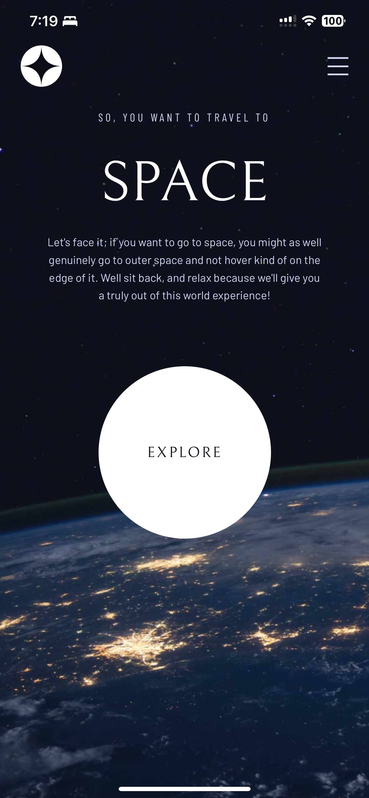
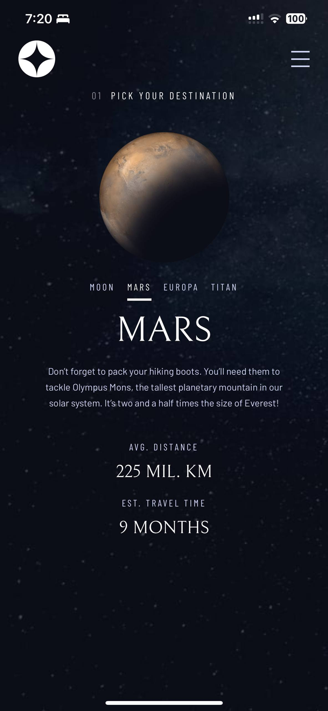
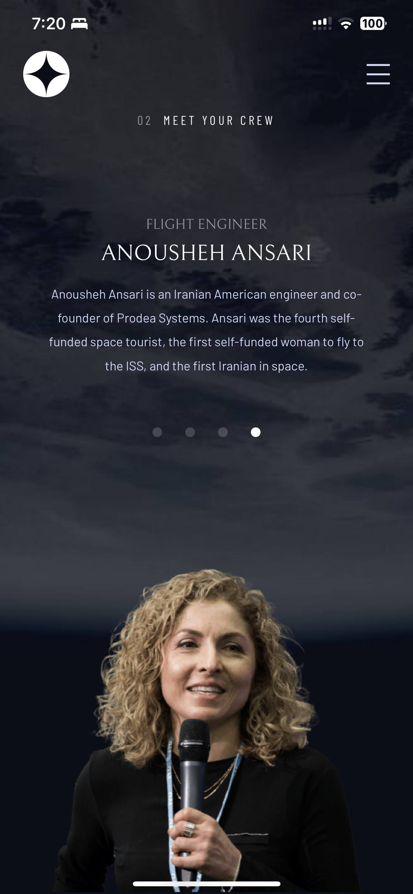
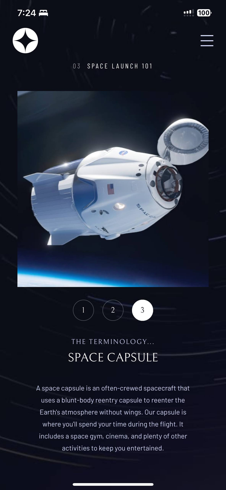
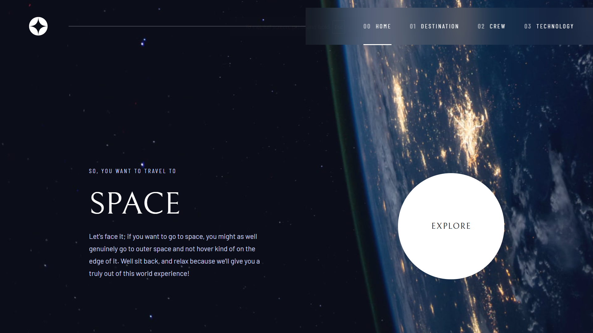
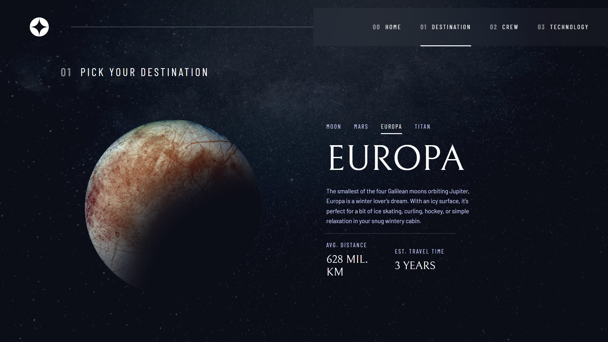
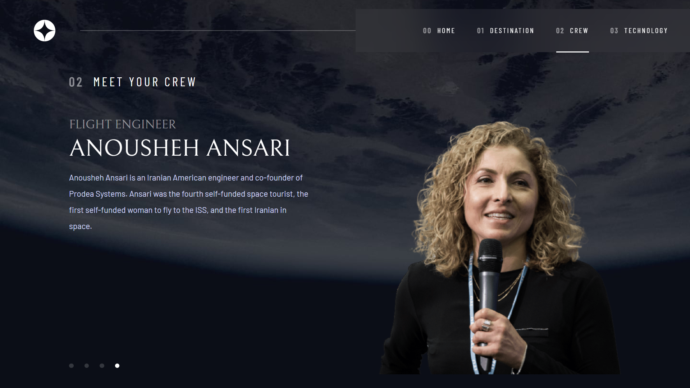
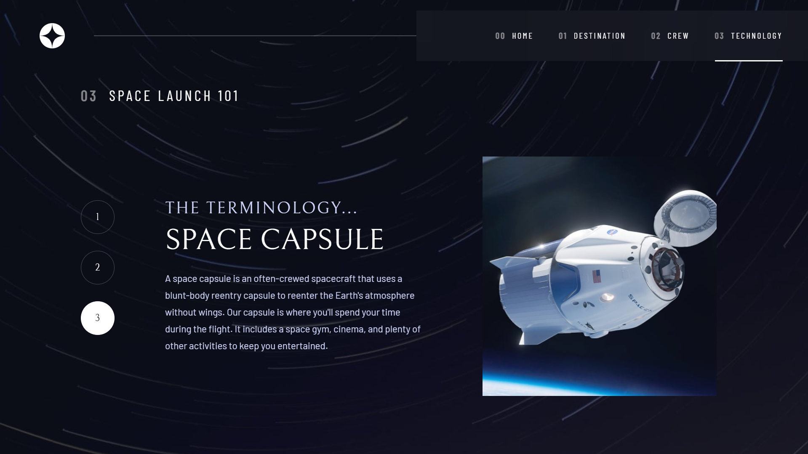

## Table of Contents
- [Overview](#overview)
- [About the Project](#about-the-project)
    - [Goals](#goals)
    - [Tools & Stack](#tools--stack)
    - [Features](#features)
    - [Links & Demo](#links--demo)
- [What I learned](#what-i-learned)
    - [More React Native Components](#more-react-native-components)
    - [State Management with `useRef`](#state-management-with-react-useref)
    - [Data Persistence with `AsyncStorage`](#data-persistence-with-asyncstorage)
    - [Improved Animations & Gestures](#improved-animations--gestures)
    - [Challenges](#challenges-faced)
- [Final Thoughts](#final-thoughts)

## Overview

For my second swim in React Native development, I tackled a [Frontend Mentor challenge](https://www.frontendmentor.io/challenges/space-tourism-multipage-website-gRWj1URZ3) to build a space tourism app.

This project was my second project built with React Native & Expo, and is the second project in my [60-day React Native challenge](https://github.com/akcumeh/rn-60d/blob/main/projects.md).


## About the Project

### Goals

- Build my second **React Native** cross-platform app
- Build on and advance in **styling in React Native** & writing CSS-in-JS
- Implement improved **interactivity** in my app
- Learn about & implement data persistence with **AsyncStorage**

### Tools & Stack

- **React Native + Expo**
- React Native **`Animated` API**
- React Native **`Reanimated` library**
- **TypeScript**
- AsyncStorage
- Route management with Expo Router

### Features

This is an interactive space tourism introduction. Users can:

- View each page
- Toggle between the tabs to see new information
- View the optimal layout for each of the website's pages depending on their device's screen size
- See hover states for all interactive elements on the page
- [Extra] Come back to their last viewed sections on each page

### Links & Demo
You can find the app here:
- [GitHub repo](https://github.com/akcumeh/13-rn-space-tourism)
- [Live link](https://space-tourism-rn.netlify.app)

Some snippets:

Mobile Screenshots:





Desktop Screenshots:






## What I learned

### More React Native **Components**

I discovered more React Native components in this project, a little further removed from web development this time.

```js
<ImageBackground source={getBg()} style={styles.bg} resizeMode="cover">
    <ScrollView contentContainerStyle={styles.content}>
        // Your content here
    </ScrollView>
</ImageBackground>
```

I learned to use `ImageBackground` for full-screen background images that adapt to different screen sizes, and `ScrollView` with `contentContainerStyle` attribute for better content layout control within scrollable areas.


### State Management with React **`useRef`**

`useState` remained an important part of my toolbox, managing the animation states, but `useRef` allowed me to maintain animation values that would update frequently but that don't trigger re-renders.

```js
const slideAnim = useRef(new Animated.Value(50)).current;
const scaleAnim = useRef(new Animated.Value(0.95)).current;
```


### Data Persistence with **AsyncStorage**

Just like JS `localStorage`, `AsyncStorage` allowed me to store and persist user choices like the selected destination or the last viewed crew member.

```js
// Save user selection
await AsyncStorage.setItem('lastDestination', destination.name);

// Load on app startup
const lastDestination = await AsyncStorage.getItem('lastDestination');
```


### Improved Animations & Gestures

I got a much clearer understanding of the anatomy of a typical gesture, thanks to [@eveningkid](https://x.com/eveningkid)'s [YouTube tutorials](https://youtube.com/playlist?list=PLiVL41zTt2lIIdZvWBwzoCjOb84DKtOX6&si=Sc8Z-qLxfwrcaJlY). I was able to progress from single animations to coordinated animation systems. On re-reading the [React Native `Animated`](https://reactnative.dev/docs/animated) docs, I found methods like `sequence()`, `parallel()`, `stagger()`, and `loop()`. I mostly used `parallel()`:

```js
Animated.parallel([
    Animated.timing(slideAnim, { toValue: 0, duration: 400 }),
    Animated.timing(scaleAnim, { toValue: 1, duration: 400 })
]).start();
```


### Distinct Responsive Layouts based on screen size

Rather than just scaling elements, I learned to create fundamentally different layouts, where mobile stacks all the page content vertically, while desktop uses a two-column layout, each optimized for their respective interaction patterns.


### Challenges Faced

- Platform differences:
\
I realized that many functions, effects or other behaviors that seem normal on web may not apply on real devices.

```js
menu: {
    backgroundColor: 'rgba(11, 13, 23, 0.15)',
    backdropFilter: 'blur(40px)', // Works in browser, not iOS
}
```

- Gestures:
\
Making a functional multi-part gesture required me to properly understand the anatomy of a gesture. [@eveningkid](https://x.com/eveningkid)'s tutorials helped me get that gestures are comprised of a start, a behavior, and a release.

## Final Thoughts
I enjoyed building this app. It was quite the challenge, but it helped me flex my layouts muscle.

I also learned to create animation systems for smooth effects, and implement slightly more complicated gestures. Thanks to this project, I learned the anatomy of a gesture, and this will serve as a building block for more complicated ones in the future.

This project is part of my [summer side quest](https://x.com/akcumeh/status/1951328182617120795).
You can follow me on [X](https://x.com/akcumeh) & [GitHub](https://github.com/akcumeh) to keep up with the full challenge.