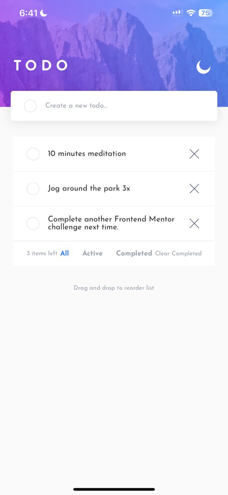
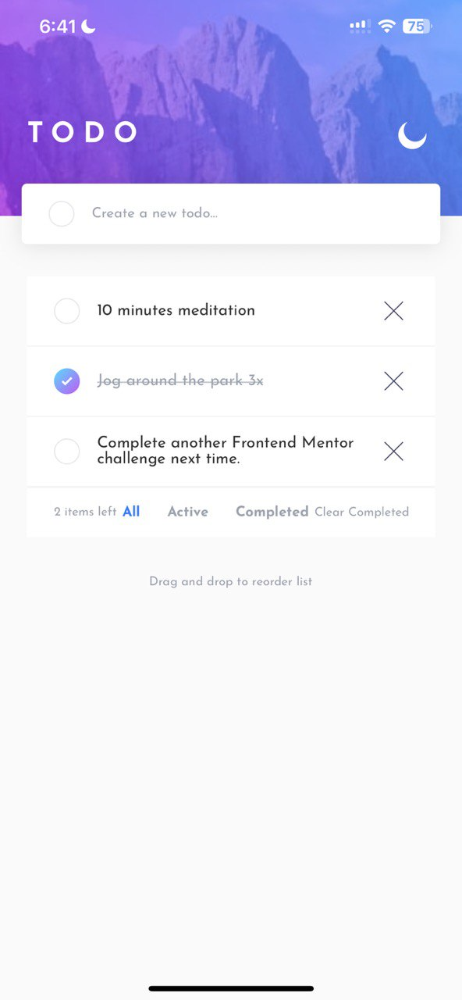
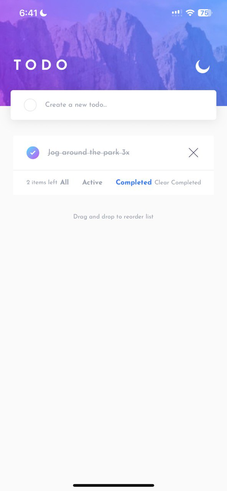
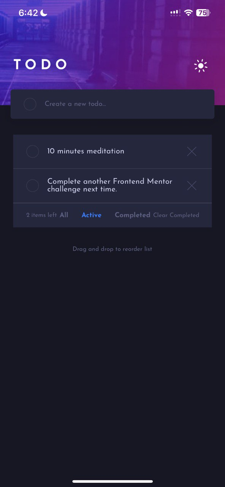
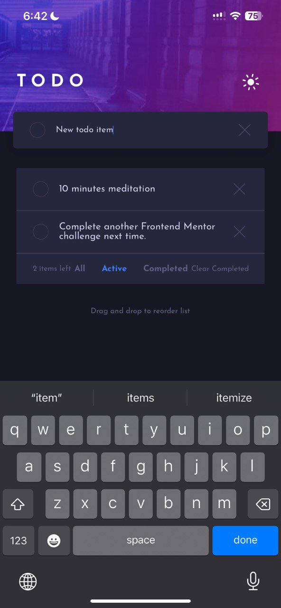

# To-do App with React Native: What I built & What I learned

## Table of Contents
- [Overview](#overview)
- [About the Project](#about-the-project)
    - [Goals](#goals)
    - [Tools & Stack](#tools--stack)
    - [Features](#features)
    - [Links & Demo](#links--demo)
- [What I learned](#what-i-learned)
    - [React Native Components](#react-native-components)
    - [Styling in React Native](#styling-in-react-native---stylesheetcreate)
    - [State Management](#state-management-with-react-usestate)
    - [Fonts](#using-custom-fonts)
    - [Animations & Gestures](#animations--gestures)
    - [Challenges](#challenges-faced)
- [Final Thoughts](#final-thoughts)

## Overview

For my first dive into React Native development, I tackled a [Frontend Mentor challenge](https://www.frontendmentor.io/challenges/todo-app-Su1_KokOW) to build a fully-featured to-do app.

This project was my first foray into the world of React Native & Expo, and is the first project in my [60-day React Native challenge](https://github.com/akcumeh/rn-60d/blob/main/projects.md).


## About the Project

### Goals

- Build my first **React Native** cross-platform mobile app
- Learn **styling in React Native** & writing CSS-in-JS
- Master fundamentals of mobile UI patterns
- Implement **animations** and **interactive gestures**

### Tools & Stack

- **React Native + Expo**
- React Native **`Animated` API**
- React Native **`Reanimated` library**
- **TypeScript**
- Expo Linear Gradient (`expo-linear-gradient`)

### Features

This is a simple to-do app with all the basic functionality, as well as a few advanced interactions. Users can:

- Add tasks
- Mark tasks as complete
- Delete tasks
- Filter tasks: view all, active or completed tasks
- Clear all completed tasks in one click
- Switch app between light & dark themes
- Drag & drop to reorder items

### Links & Demo
You can find the app here:
- [GitHub repo](https://github.com/akcumeh/16-todo-app)
- [Live link](https://akcumeh.github.io/16-todo-app)

Some snippets:







## What I learned

### React Native **Components**


Components are the essential building blocks of React Native apps.
They are analogous to other common elements used in web, Android and iOS app development.

In this project I dealt directly with the following:
- `View`
- `Text`
- `Button`
- `Image`
- `TextInput`
- `TouchableOpacity`
- `ScrollView`
- `FlatList`

Coming from a web development background, it was very interesting to draw the following parallels:

| React Native Component | Web Equivalent | Description
--------------|-------------|----------------
| `<View>` | non-scrollable `<div>` | A simple box that accepts layout, styling, user controls and accessibility controls, representing its children (however, does not scroll)
| `<Text>` | `<p>`, `<span>` | Used for displaying strings of text
| `<Button>` | `<button>` | A basic button with native styling (hence it looks different on web vs iOS)
| `<Image>` | `` | An element that displays most types of pictures / images
| `<TextInput>` | `<input type="text">` | An input item that takes text
| `<TouchableOpacity>` | `<button>` | A more customizable button with native touch feedback & accessibility that can nest other content like images
| `<ScrollView>` | `<div>` | A simple scrollable box that accepts layout, styling, user controls and accessibility controls, representing its children and rendering all its items at once
| `<FlatList>` | `<li>` | A list, with lazy rendering for large datasets.


### Styling in React Native - **`Stylesheet.create()`**

React Native styling felt familiar. Here, CSS must be written in a JavaScript Object that is then passed into the `Stylesheet.create()` function. Then when any new element is created, the specific style(s) that apply are called in its style attribute. For example:

```js
const styles = Stylesheet.create({
    container1: {
        backgroundColor: #d34a76,
        width: 100,
    },
    container2: {
        backgroundColor: #c23ad4,
        width: 200,
        fontSize: 20,
        color: #38005d,
    }
});

const TestApp = () => {
    return (
        <View style={styles.container1}>
            Hi, I am Container 1.
        </View>
        <View style={styles.container2}>
            Hi, I am Container 2.
        </View>
    );
}

export default TestApp;
```

Some key differences from web CSS:
- **Flexbox by default**: Every View uses flexbox layout
- **Column-first**: Default `flexDirection` is `column`, this makes sense for mobile apps.
- **No cascading**: Styles are scoped to components


### **State Management with React `useState`**

State Management is used to handle data within a component that is expected to change over time - it is like storage, but for React components.

Managing many parts of my todo list required careful consideration and handling of data flow. `useState` was used to manage the app theme and filter the todo list, while `useMemo` minimized unnecessary rerenders when filtering large lists.


### Using custom fonts

In an Expo project, there are two ways to import and use custom fonts other than the native font or Expo-provided fonts:
- Add the font assets to your project and import them, or
- Use the [`expo-google-fonts`](https://github.com/expo/google-fonts) library - for example, my app uses Josefin Sans, so I installed `expo-google-fonts/josefin-sans`.

- Using linear gradients in Expo
- Creating animations in React Native


### Animations & Gestures

I implemented two animation systems:
- React Native **Animated API** for simple animations:
```js
const fadeAnim = useRef(new Animated.Value(0)).current;

Animated.timing(fadeAnim, {
  toValue: 1,
  duration: 300,
  useNativeDriver: true,
}).start();
```

- React Native **Reanimated** library for hold-drag-and-drop gestures


### Challenges Faced

- Integrating SVG Assets

All of my icon assets were in SVG format, but React Native doesn't support SVGs out of the box. I had to:

    - Install `react-native-svg` and `react-native-svg-transformer`
    - Configure Metro bundler to handle SVG files:

    ```javascript
    config.transformer.babelTransformerPath = require.resolve('react-native-svg-transformer');
    config.resolver.assetExts = config.resolver.assetExts.filter(ext => ext !== 'svg');
    config.resolver.sourceExts.push('svg');
    ```

    - Import SVGs as React components:
    ```javascript
    import CrossIcon from '../assets/images/icon-cross.svg';
    ```

- iOS compatibility issues:
\
I learned to always specify `flex` or `height` properties for consistent cross-platform rendering.

- Animations:
\
Making an intuitive drag & drop gesture required that I do:
    - Gesture detection: I had to use a long-press to activate it to avoid interfering with the scrolling behavior.
    - Position calculations: I had to detect where exactly the dragged item was being placed and do a little math to make sure that it was dropped at the right position.
    - Spring motion: I included a small spring motion in order to make it more intuitive - something being picked up should appear to lift up and away from the list (closer to the user).

## Final Thoughts
It was fun to experience building mobile apps for the first time.

React Native is very similar to React. The component-based architecture, hooks, and state management patterns all translate directly from my web development experience to mobile development. 
\
Flexbox-by-default and the component system make building responsive mobile UIs more straightforward than I expected.

The animation APIs also opened my eyes to new possibilities for creating engaging, visually appealing and intuitive UXs that improve the "mobile app" feel. There's definitely more to learn before I move on to more complex gestures.

I look forward to more complex projects and making future apps more accessible.

This project is part of my [summer side quest](https://x.com/akcumeh/status/1951328182617120795).
You can follow me on [X](https://x.com/akcumeh) & [GitHub](https://github.com/akcumeh) to keep up with the full challenge.